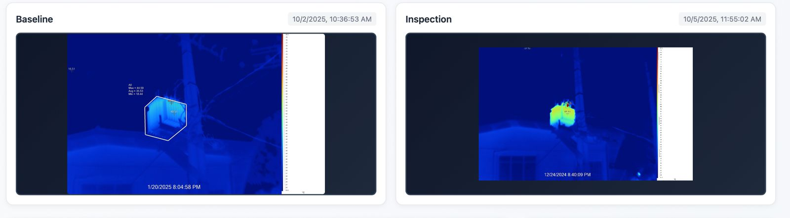
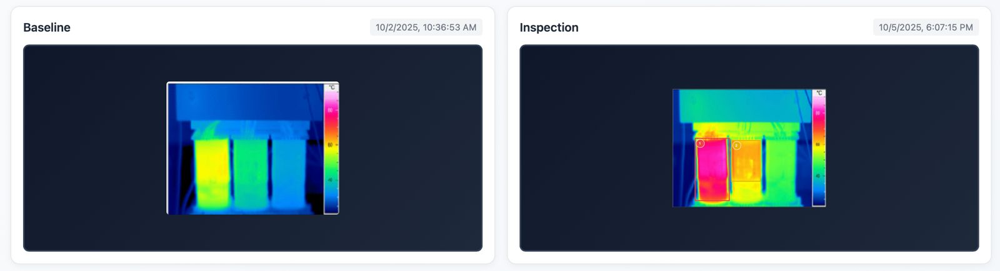
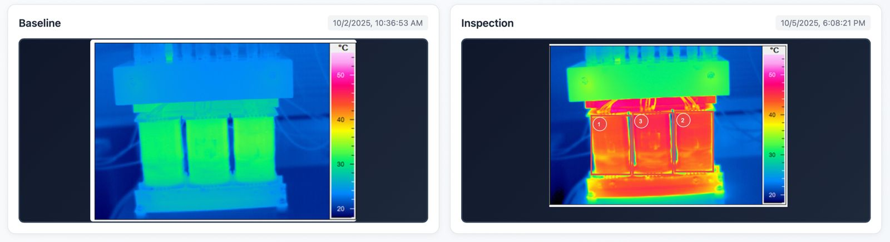

# TransX - Transformer Maintenance Platform

> **Complete 4-Phase Implementation:** Transformer Management, Anomaly Detection, Annotation System, and Comprehensive Inspection Workflow

A full-stack application for managing electrical transformers with AI-powered thermal image analysis, annotation system, and comprehensive inspection workflow. Built with React, TypeScript, Spring Boot, MySQL, and YOLOv8 machine learning.

## Features

### Phase 1: Transformer & Image Management
- **Transformer Management** - Create, update, and manage transformers with code, location, and capacity information
- **Thermal Image Upload** - Upload thermal images tagged as **Baseline** (with environmental conditions: SUNNY/CLOUDY/RAINY) or **Maintenance**
- **Side-by-Side Comparison** - Compare images on transformer detail page with intelligent fallback display
- **Local File Storage** - Secure file uploads with organized storage structure

### Phase 2: AI-Powered Anomaly Detection
**Inspection and Anomaly Detection Workflow**

- **Similarity Check:**
  - When an inspection image is uploaded, the backend first performs a similarity check between the **baseline** and **maintenance** images.
  - This process determines whether both images were captured from approximately the same angle and viewpoint.
  - The computed similarity value is stored as a flag for use in the final comparison stage.

- **YOLOv8 Based Anomaly Detection:**
  - Regardless of the similarity outcome, both images are forwarded to the **YOLOv8 model** for anomaly detection.
  - The model analyzes the **maintenance (inspection)** thermal image and identifies potential faults or abnormal heat zones.

- **Detected Fault Classes:**
  - **Faulty (Class 0)** – 🔴 *Loose joints or point overloads*
  - **Faulty Loose Joint (Class 1)** – 🟢 *Localized loose joints*
  - **Faulty Point Overload (Class 2)** – 🔵 *Specific point overloads*
  - **Potential Faulty (Class 3)** – 🟡 *Yellowish joints or wire overloads*

- **Detection Output:**
  - Each detected region includes:
    - Bounding box coordinates `(x₁, y₁, x₂, y₂)`
    - Predicted class label
    - Confidence score

- **Comparative Analysis (if Similarity Passes):**
  - If the similarity check confirms matching viewpoints, a **comparative analysis** is performed between the baseline and inspection images.
  - Based on threshold values, bounding boxes are fine-tuned to align accurately with the baseline reference.

- **Visualization & User Interaction:**
  - Final anomalies are visualized on the maintenance image using **color-coded bounding boxes** for each fault type.
  - The interface allows engineers to:
    - Approve or reject detections
    - Add notes and comments
    - Save the updated inspection record

- **Data Logging & Traceability:**
  - All user actions — detections, approvals, rejections, and comments — are securely stored in the database.
  - Provides a complete audit trail for **traceability and analysis**.

- **System Integration:**
  - Demonstrates end-to-end integration of:
    - YOLOv8 inference engine  
    - Flask-based ML microservice  
    - Spring Boot backend  
    - React TypeScript frontend


**Sample JSON Output**
~~~json
{
  "success": true,
  "detections": [
    {
      "id": "uuid-string",
      "class_id": 0,
      "class_name": "Faulty",
      "confidence": 0.87,
      "bbox": { "x1": 120, "y1": 150, "x2": 300, "y2": 400 },
      "color": [255, 0, 0],
      "source": "ai"
    }
  ],
  "image_dimensions": { "width": 1920, "height": 1080 },
  "inference_time_ms": 245.3,
  "model_info": {
    "type": "YOLOv8",
    "classes": {
      "0": "Faulty",
      "1": "faulty_loose_joint",
      "2": "faulty_point_overload",
      "3": "potential_faulty"
    }
  }
}
~~~
**Side-by-Side Image Comparison View**
- React frontend displays baseline (left) and maintenance (right) images.
  





### Phase 3: Interactive Annotation & Feedback System  

**Annotation Creation & Editing**

- When a user draws or edits a bounding box on the annotation canvas (**AnnotationCanvas.tsx**), the coordinates, class label, and optional note are captured.  
- Each action (`ADD`, `EDIT`, `DELETE`, `APPROVE`, `REJECT`) is automatically sent to the backend no manual “Save” button is required.  
  Every modification triggers an API call that immediately updates the database.

---

### ⚙️ Backend API Controllers

| Controller | Purpose | Key Endpoints |
|-------------|----------|---------------|
| **AnnotationController.java** | Core of the annotation module manages bounding box creation, updates, deletions, approvals/rejections, and feedback export. | `POST /api/annotations` • `POST /api/annotations/batch` • `DELETE /api/annotations/{id}` • `POST /api/annotations/{id}/approve` • `POST /api/annotations/{id}/reject` • `GET /api/annotations?inspectionId={inspectionId}` • `GET /api/annotations/feedback/export?inspectionId={inspectionId}` |
| **InspectionController.java** | Handles inspection creation, image upload, anomaly detection, and YOLOv8 ML service integration. | `POST /api/inspections` • `POST /api/inspections/{id}/detect-anomalies` • `POST /api/inspections/{id}/upload-image` • `POST /api/inspections/{id}/upload-annotated-image` • `PUT /api/inspections/{id}/status` • `GET /api/inspections/ml-service/health` |
| **InspectionCommentController.java** | Enables threaded comments and notes for collaborative engineer feedback. | `POST /api/inspection-comments` • `GET /api/inspection-comments/inspection/{inspectionId}` • `DELETE /api/inspection-comments/{commentId}` |
| **InspectionHistoryController.java** | Tracks revision history, inspector access, and inspection statistics for auditability. | `POST /api/inspections/{inspectionId}/history/access` • `GET /api/inspections/{inspectionId}/history` • `GET /api/inspections/{inspectionId}/history/summary` • `GET /api/inspections/{inspectionId}/history/stats` |
| **ThermalImageController.java** | Manages upload and retrieval of transformer thermal images (Baseline / Inspection). | `POST /api/images` • `GET /api/images` |
| **TransformerController.java** | CRUD operations for transformer metadata (ID, location, capacity). | `POST /api/transformers` • `GET /api/transformers` • `PUT /api/transformers/{id}` • `DELETE /api/transformers/{id}` |
| **ApiExceptionHandler.java** | Global exception handler for consistent REST error responses. | *(Handles `DataIntegrityViolationException` → returns `409 Conflict`)* |
| **HealthController.java** | Quick backend status check for integration and CI/CD probes. | `GET /api/health` |

All controllers belong to the package  
`com.acme.backend.api` and communicate with their corresponding service classes in  
`com.acme.backend.service`.

All annotation-related requests are **JSON-based** and persisted in the  
`annotations` and `annotation_history` tables of the `en3350_db` MySQL database.

---

### 🧠 Backend Processing

- The **Spring Boot backend** receives JSON payloads (from frontend API calls) and maps them to JPA entities such as `Annotation`, `Inspection`, and `InspectionComment`.  
- Metadata such as `user_id`, `inspection_id`, `transformer_id`, and `timestamp` are automatically appended.  
- The updated records are persisted via **Spring Data JPA** in the relational database (`en3350_db`).  
- All actions — add, edit, approve, reject are versioned for traceability through the `InspectionHistoryController`.

---
- **Annotation Retrieval:**
  - When an inspection is reopened, the frontend calls the **annotations API client** (`frontend/src/api/annotations.ts`) to fetch all boxes for that inspection.
  - Endpoint used:
    ```
    GET /api/annotations?inspectionId={inspectionId}
    ```
  - The response is rendered back onto the canvas with correct coordinates, labels, and fault types.

- **Feedback Export & Dataset Generation:**
  - All annotation logs (AI + user) are exported as structured JSON:
    ```
    GET /api/annotations/export/{inspectionId}
    ```
  - These JSON files are automatically saved under:
    ```
    /ml-service/feedback_data/
    ```
    (Each file is named as `feedback_<inspection_id>_<timestamp>.json`)
  - The script **targeted_dataset_creator.py** processes these JSONs and converts them into **YOLO-format datasets** (`.txt` label files with bounding box coordinates and class IDs).
  - The generated dataset is then used by the **quick_finetune/** or **train_yolo_fixed.py** script to **fine-tune the YOLOv8 model**, improving accuracy using real user feedback.
  - After finetuning, new weights are saved at:
    ```
    runs/detect/feedback_finetune/weights/best.pt
    ```
  - The **Flask ML service (`app.py`)** is automatically updated to use the new model weights for future detections.


---

**Python ML Service Endpoints (for Integration)**  
_Add your Flask/YOLOv8 endpoints here once finalized. 

---

**Database Dump for Record Storage**


#### 🧩 Core Tables

| Table | Purpose |
|--------|----------|
| **annotations** | Stores bounding box coordinates, class IDs, confidence scores, and metadata for AI and human detections. Each record tracks its source (`ai` or `human`) and action type (`created`, `edited`, `approved`, `rejected`, `deleted`). |
| **annotation_history** | Maintains full version history for each annotation (snapshot JSON per action). Enables rollback and change traceability. |
| **box_numbering_sequence** | Tracks incremental bounding-box numbering per inspection session to maintain unique indices. |
| **inspection_access_log** | Logs inspector session details — including edit/view access, timestamps, and user device/IP metadata. |

#### ⚙️ Schema Extract (MySQL 8.0)

```sql
-- Table structure for table `annotations`
CREATE TABLE `annotations` (
  `id` binary(16) NOT NULL,
  `inspection_id` binary(16) NOT NULL,
  `version` int DEFAULT '1',
  `bbox_x1` int NOT NULL,
  `bbox_y1` int NOT NULL,
  `bbox_x2` int NOT NULL,
  `bbox_y2` int NOT NULL,
  `class_id` int DEFAULT NULL,
  `class_name` varchar(50) DEFAULT NULL,
  `confidence` decimal(5,3) DEFAULT NULL,
  `source` enum('ai','human') NOT NULL,
  `action_type` enum('created','edited','deleted','approved','rejected') DEFAULT 'created',
  `created_by` varchar(100) DEFAULT NULL,
  `modified_by` varchar(100) DEFAULT NULL,
  `created_at` timestamp NULL DEFAULT CURRENT_TIMESTAMP,
  `modified_at` timestamp NULL DEFAULT NULL,
  `is_active` tinyint(1) DEFAULT '1',
  PRIMARY KEY (`id`),
  KEY `idx_inspection_id` (`inspection_id`),
  CONSTRAINT `annotations_ibfk_1` FOREIGN KEY (`inspection_id`) REFERENCES `inspections` (`id`) ON DELETE CASCADE
) ENGINE=InnoDB DEFAULT CHARSET=utf8mb4 COLLATE=utf8mb4_unicode_ci;

-- Table structure for table `annotation_history`
CREATE TABLE `annotation_history` (
  `id` binary(16) NOT NULL,
  `annotation_id` binary(16) NOT NULL,
  `inspection_id` binary(16) NOT NULL,
  `action_type` varchar(50) DEFAULT NULL,
  `snapshot_data` json DEFAULT NULL,
  `user_id` varchar(100) DEFAULT NULL,
  `created_at` timestamp NULL DEFAULT CURRENT_TIMESTAMP,
  PRIMARY KEY (`id`),
  KEY `idx_annotation_id` (`annotation_id`),
  CONSTRAINT `annotation_history_ibfk_1` FOREIGN KEY (`annotation_id`) REFERENCES `annotations` (`id`) ON DELETE CASCADE
) ENGINE=InnoDB DEFAULT CHARSET=utf8mb4 COLLATE=utf8mb4_unicode_ci;

-- Table structure for table `box_numbering_sequence`
CREATE TABLE `box_numbering_sequence` (
  `inspection_id` binary(16) NOT NULL,
  `next_box_number` int NOT NULL DEFAULT '1',
  `last_updated_at` timestamp NULL DEFAULT CURRENT_TIMESTAMP ON UPDATE CURRENT_TIMESTAMP,
  PRIMARY KEY (`inspection_id`),
  CONSTRAINT `box_numbering_sequence_ibfk_1` FOREIGN KEY (`inspection_id`) REFERENCES `inspections` (`id`) ON DELETE CASCADE
) ENGINE=InnoDB DEFAULT CHARSET=utf8mb4 COLLATE=utf8mb4_unicode_ci;

-- Table structure for table `inspection_access_log`
CREATE TABLE `inspection_access_log` (
  `id` binary(16) NOT NULL,
  `inspection_id` binary(16) NOT NULL,
  `user_name` varchar(255) NOT NULL,
  `access_type` enum('VIEW','EDIT','CREATE') NOT NULL,
  `session_start` timestamp NULL DEFAULT CURRENT_TIMESTAMP,
  `session_end` timestamp NULL DEFAULT NULL,
  PRIMARY KEY (`id`),
  KEY `idx_inspection_id` (`inspection_id`),
  CONSTRAINT `inspection_access_log_ibfk_1` FOREIGN KEY (`inspection_id`) REFERENCES `inspections` (`id`) ON DELETE CASCADE
) ENGINE=InnoDB DEFAULT CHARSET=utf8mb4 COLLATE=utf8mb4_unicode_ci;
```

### Phase 4: Inspection Management & Collaboration
- **Inspection Lifecycle** - Complete workflow from creation to completion
- **Multi-User Comments** - Real-time commenting system with author tracking
- **Notes System** - Inspection-specific notes and observations  
- **Status Tracking** - PENDING → IN_PROGRESS → COMPLETED workflow
- **Image Management** - Upload, remove, and re-upload inspection images before detection
- **Transformer Filtering** - Filter inspections by specific transformer

### Additional Features
- **Type-Safe APIs** - Full TypeScript support with defensive UI patterns
- **Real-time Updates** - Live comment updates and status changes
- **Responsive Design** - Works on desktop and tablet devices
- **Error Handling** - Comprehensive error boundaries and user feedback

## Technology Stack

| Component | Technology |
|-----------|------------|
| **Frontend** | React 18, TypeScript, Vite, React Router, Konva.js (Canvas) |
| **Backend** | Spring Boot 3.3, Java 21, Spring Data JPA, RESTful APIs |
| **ML Service** | Flask, Python, YOLOv8p2, OpenCV, Pillow |
| **Database** | MySQL with comprehensive schema (transformers, inspections, annotations, comments) |
| **File Storage** | Local disk storage with HTTP serving and organized structure |
| **AI/ML** | YOLOv8p2 trained model for thermal anomaly detection |
| **CORS** | Configured for development environment |

## Prerequisites

Before you begin, ensure you have the following installed:

- **Node.js** ≥ 18 and npm
- **Java** 21 (or 17)
- **Python** ≥ 3.8 (for ML service)
- **Gradle** (handled by wrapper)
- **MySQL Community Server** ≥ 8.0 (version 9.4.0 recommended)
- **MySQL Workbench** (for database management)
- **IDE**: IntelliJ IDEA (recommended) or any Java IDE
- **curl** (optional, for API testing)

## Project Structure

```
transformer-inspector/
├── backend/                                # Spring Boot Application
│   ├── src/main/java/com/acme/backend/
│   │   ├── api/                           # REST Controllers
│   │   │   ├── TransformerController.java
│   │   │   ├── InspectionController.java
│   │   │   ├── InspectionCommentController.java
│   │   │   ├── AnnotationController.java
│   │   │   └── ThermalImageController.java
│   │   ├── api/dto/                       # Data Transfer Objects
│   │   │   ├── CreateTransformerReq.java, TransformerDTO.java
│   │   │   ├── CreateInspectionReq.java, InspectionDTO.java
│   │   │   ├── CreateAnnotationReq.java, AnnotationDTO.java
│   │   │   ├── InspectionCommentDTO.java
│   │   │   ├── DetectionResponse.java
│   │   │   └── ThermalImageDTO.java
│   │   ├── config/                        # Configuration Classes
│   │   │   ├── CorsConfig.java
│   │   │   ├── DataSeeder.java (with sample images)
│   │   │   └── StaticFileConfig.java
│   │   ├── domain/                        # Entity Models
│   │   │   ├── Inspection.java (with status workflow)
│   │   │   ├── Annotation.java (with fault classifications)
│   │   │   ├── InspectionComment.java (multi-user comments)
│   │   │   ├── Transformer.java
│   │   │   └── ThermalImage.java
│   │   ├── repo/                          # JPA Repositories
│   │   │   ├── InspectionRepo.java, TransformerRepo.java
│   │   │   ├── AnnotationRepo.java, InspectionCommentRepo.java
│   │   │   └── ThermalImageRepo.java
│   │   ├── service/                       # Business Logic
│   │   │   ├── InspectionService.java (with ML integration)
│   │   │   ├── InspectionCommentService.java
│   │   │   ├── MLServiceClient.java
│   │   │   └── FileStorageService.java
│   │   └── storage/                       # File Storage Service
│   │       └── FileStorageService.java
│   ├── src/main/resources/
│   │   └── application.properties (with ML service config)
│   └── build.gradle
│
├── frontend/
│   ├── src/
│   │   ├── api/                           # API Client Layer
│   │   │   ├── client.ts, transformers.ts, inspections.ts
│   │   │   ├── annotations.ts, inspectionComments.ts
│   │   │   └── images.ts
│   │   ├── components/                    # UI Components
│   │   │   ├── ErrorBoundary.tsx, Layout.tsx, FileDrop.tsx
│   │   │   ├── AnnotationCanvas.tsx (Konva.js canvas)
│   │   │   ├── AnnotationToolbar.tsx (mode controls)
│   │   │   ├── AnnotationLegend.tsx, AnnotationCard.tsx
│   │   │   ├── CommentsSection.tsx (real-time comments)
│   │   │   ├── NotesSection.tsx
│   │   │   └── Input.tsx, Select.tsx, Table.tsx, Modal.tsx
│   │   ├── pages/                         # Page Components
│   │   │   ├── Dashboard.tsx, TransformersList.tsx
│   │   │   ├── TransformerDetail.tsx, TransformerForm.tsx
│   │   │   ├── InspectionList.tsx
│   │   │   ├── InspectionDetailNew.tsx (full annotation interface)
│   │   │   ├── ImagesList.tsx, ImageUpload.tsx
│   │   │   └── InspectionDetail.tsx (legacy view)
│   │   ├── App.tsx, main.tsx
│   │   └── vite-env.d.ts
│   ├── package.json (with Konva.js dependencies)
│   └── tsconfig.json, vite.config.ts
│
├── ml-service/                            # Flask ML Microservice
│   ├── app.py                            # Flask application with YOLOv8
│   ├── requirements.txt                  # Python dependencies
│   ├── setup.sh                          # Setup script
│   └── README.md                         # ML service documentation
│
├── Faulty_Detection/                     # ML Model Training
│   ├── train_yolo_fixed.py              # Training script
│   ├── yolov8p2_single_inference.py     # Inference testing
│   ├── yolov8n.pt, yolov8p2.pt         # Model files
│   └── samples/                          # Training data
│
└── Database-MYSQL/
    └── en3350_db.sql            # Latest schema
```

## Quick Start

### 1. Clone Repository
```bash
git clone https://github.com/PrabathBK/TransX-Transformer-Maintenance-Platform.git
cd TransX-Transformer-Maintenance-Platform
```

### 2. Database Setup

1. **Install MySQL Community Server**
   - Install **MySQL Community Server** (version **9.4.0** recommended, but ≥ 8.0 works)
   - Install **MySQL Workbench** during setup
   - During installation, set your own **root username and password** (keep these safe for later configuration)

2. **Verify MySQL Server is running**
   - Open **MySQL Workbench**
   - Check that your MySQL instance (e.g., *Local instance MySQL94*) is **running**
   - If stopped, start it using the **Server Start/Stop** button

3. **Create the database schema**
   ```sql
   CREATE DATABASE en3350_db;
   ```

4. **Import the complete SQL dump**
   - In Workbench, go to **Server > Data Import**
   - Select **Import from Self-Contained File**
   - File path: `Database-MYSQL/en3350_db.sql`
   - Set **Default Target Schema** to `en3350_db`
   - Set **Import Options** to **Dump Structure and Data**
   - Click **Start Import**

5. **Verify the import**
   - Refresh the **Schemas** panel
   - Expand `en3350_db` → **Tables**
   - You should see tables: `transformers`, `thermal_images`, `inspections`, `annotations`, `inspection_comments`

### 3. ML Service Setup

1. **Navigate to ML service directory**
   ```bash
   cd ml-service
   ```
2. **Create and activate virtual environment**
   ```bash
   # Create virtual environment
   python -m venv venv

   # Activate virtual environment
   .\venv\Scripts\activate
   ```
3. **Install Python dependencies**
   ```bash
   # Ensure pip is up to date
   python -m pip install --upgrade pip

   # Install requirements
   pip install -r requirements.txt
   ```

4. **Start the ML service**
   ```bash
   python app.py
   ```
   
   🟢 ML Service will start at **http://localhost:5001**

### 4. Backend Configuration

1. **Navigate to backend directory**
   ```bash
   cd transformer-inspector/backend
   ```

2. **Configure `application.properties`**
   ```properties
   # MySQL Database Configuration
   spring.datasource.url=jdbc:mysql://localhost:3306/en3350_db
   spring.datasource.username=YOUR_MYSQL_USERNAME
   spring.datasource.password=YOUR_MYSQL_PASSWORD
   spring.datasource.driver-class-name=com.mysql.cj.jdbc.Driver
   spring.jpa.hibernate.ddl-auto=update
   spring.jpa.show-sql=true
   spring.jpa.database-platform=org.hibernate.dialect.MySQLDialect

   # File Storage Configuration
   app.server.public-base-url=http://localhost:8080
   app.storage.root=uploads

   # ML Service Configuration (YOLOv8 Detection)
   app.ml-service.url=http://localhost:5001
   app.ml-service.timeout=30000

   # CORS Configuration
   app.cors.allowed-origins=http://localhost:5173
   ```

3. **Start the backend server**
   ```bash
   ./gradlew bootRun
   ```
   
   🟢 Server will start at **http://localhost:8080**

### 5. Frontend Setup

1. **Navigate to frontend directory**
   ```bash
   cd transformer-inspector/frontend
   ```

2. **Install dependencies**
   ```bash
   npm install
   ```

3. **Start the development server**
   ```bash
   npm run dev
   ```
   
   🟢 Application will be available at **http://localhost:5173**

### Quick Multi-Service Startup

```bash
# Terminal 1: Start ML Service
cd ml-service && pip install -r requirements.txt && python app.py

# Terminal 2: Start Backend
cd transformer-inspector/backend && ./gradlew bootRun

# Terminal 3: Start Frontend  
cd transformer-inspector/frontend && npm install && npm run dev
```

## Testing the Complete System

### 1. Access the Application
- Open browser to **http://localhost:5173**
- Navigate to **Transformers** → Select any transformer
- Click **"View Inspections"** → **"Create New Inspection"**

### 2. Test Anomaly Detection Workflow
1. **Upload Inspection Image** - Try different sizes (640×640, 3077×1920, etc.)
2. **Remove/Re-upload** - Use "Remove Image" button to test image management
3. **Detect Anomalies** - Click "Detect Anomalies" to trigger YOLOv8 analysis
4. **Review Results** - See detected faults with confidence scores
5. **Approve/Reject** - Validate each detection with approve/reject buttons

### 3. Test Annotation System
1. **Manual Annotation** - Switch to "Draw" mode and create bounding boxes
2. **Edit Annotations** - Switch to "Edit" mode to resize/move annotations  
3. **Zoom & Pan** - Test canvas navigation with large images
4. **Save & Complete** - Save annotated image and complete inspection

### 4. Test Comment System
1. **Add Comments** - Write inspection notes and observations
2. **Multi-User** - Test with different author names
3. **Real-time Updates** - Comments appear immediately

### 5. Verify Data Persistence
- Check that annotations, comments, and status changes persist
- Verify transformer-specific inspection filtering works
- Test inspection completion workflow

## Application URLs & API Reference

### Frontend Routes
| URL | Description |
|-----|-------------|
| `http://localhost:5173` | Dashboard |
| `http://localhost:5173/transformers` | Transformer Overview |
| `http://localhost:5173/transformers/{ID}` | Transformer Details with Inspections |
| `http://localhost:5173/inspections` | All Inspections List |
| `http://localhost:5173/inspections/{ID}` | Full Inspection Interface with Annotations |
| `http://localhost:5173/images` | Thermal Images Management |

### API Endpoints

#### Transformer Management
- `GET /api/transformers` - List all transformers
- `POST /api/transformers` - Create new transformer
- `GET /api/transformers/{id}` - Get transformer details
- `PUT /api/transformers/{id}` - Update transformer
- `DELETE /api/transformers/{id}` - Delete transformer

#### Inspection Management (Phase 2-4)
- `GET /api/inspections` - List inspections with filtering (`?transformerId=uuid`)
- `POST /api/inspections` - Create new inspection
- `GET /api/inspections/{id}` - Get inspection details
- `PUT /api/inspections/{id}` - Update inspection
- `PUT /api/inspections/{id}/status` - Update inspection status
- `DELETE /api/inspections/{id}` - Delete inspection
- `POST /api/inspections/{id}/upload-image` - Upload inspection image
- `DELETE /api/inspections/{id}/inspection-image` - Remove inspection image
- `POST /api/inspections/{id}/detect-anomalies` - Trigger YOLOv8 detection
- `POST /api/inspections/{id}/upload-annotated-image` - Save annotated canvas

#### Annotation Management
- `GET /api/annotations/inspection/{inspectionId}` - Get annotations for inspection
- `POST /api/annotations` - Create new annotation
- `PUT /api/annotations/{id}` - Update annotation
- `DELETE /api/annotations/{id}` - Delete annotation
- `POST /api/annotations/{id}/approve` - Approve detected annotation
- `POST /api/annotations/{id}/reject` - Reject detected annotation

#### Comment System
- `GET /api/inspections/{inspectionId}/comments` - Get inspection comments
- `POST /api/inspections/{inspectionId}/comments` - Add new comment
- `PUT /api/inspection-comments/{id}` - Update comment
- `DELETE /api/inspection-comments/{id}` - Delete comment

#### Thermal Image Management
- `GET /api/images` - List all thermal images
- `POST /api/images` - Upload thermal image
- `GET /api/images/{id}` - Get image details

#### ML Service Integration
- `GET /api/inspections/ml-service/health` - Check ML service status
- Backend automatically calls ML service for anomaly detection

#### File Serving
- `GET /files/**` - Serve uploaded files and images

## File Storage Structure

Files are organized as follows:
```
uploads/
├── {UUID}/                              # Generated UUID for each upload
│   └── filename.jpg                     # Original filename preserved
├── {UUID}/
│   └── thermal_image_001.png
└── {UUID}/
    └── annotated_image_with_boxes.jpg   # Canvas-captured annotated images
```

- **Storage Path**: `<backend-root>/uploads/{uuid}/filename`
- **Public Access**: Files served via `/files/**` endpoint at `http://localhost:8080/files/{uuid}/filename`
- **Organization**: Each upload gets a unique UUID directory
- **Supported Formats**: JPG, PNG, JPEG for thermal images
- **Image Scaling**: Frontend automatically handles images from 640×640 to 3077×1920+ resolution

## Development & Advanced Usage

### Hot Reload & Development
- **Frontend**: Automatic reload via Vite HMR
- **Backend**: Use Spring Boot DevTools or manual restart
- **ML Service**: Manual restart required after model changes

### Environment Variables
Create a `.env` file in the frontend directory:
```env
VITE_API_BASE_URL=http://localhost:8080
```

### ML Service Configuration
The ML service can be configured in `ml-service/app.py`:
```python
# Model confidence threshold
DEFAULT_CONFIDENCE = 0.25

# Model path
MODEL_PATH = "yolov8p2.pt"  # Place your trained model here

# Server port
if __name__ == '__main__':
    app.run(host='0.0.0.0', port=5001, debug=True)
```

### Sample API Testing
```bash
# Get all transformers
curl http://localhost:8080/api/transformers

# Get inspections for a transformer
curl "http://localhost:8080/api/inspections?transformerId=TRANSFORMER_UUID"

# Check ML service health
curl http://localhost:8080/api/inspections/ml-service/health

# Trigger anomaly detection
curl -X POST "http://localhost:8080/api/inspections/INSPECTION_ID/detect-anomalies?confidenceThreshold=0.3"
```

### Troubleshooting

#### Common Issues
1. **ML Service Connection Failed**
   - Ensure Python dependencies installed: `pip install -r ml-service/requirements.txt`
   - Verify ML service running on port 5001
   - Check model file `yolov8p2.pt` exists in ml-service directory

2. **Large Images Not Displaying in Canvas**
   - Issue resolved: Canvas now auto-scales images of any size
   - Supports images from 640×640 to 3077×1920+ resolution

3. **Inspection Complete Button 404 Error**
   - Issue resolved: Added `/api/inspections/{id}/status` endpoint
   - Restart backend after code changes

4. **Database Connection Issues**
   - Verify MySQL server is running
   - Check credentials in `application.properties`
   - Ensure database `en3350_db` exists with proper schema

### Performance Notes
- **Image Processing**: Large thermal images (3000+ pixels) are handled efficiently
- **ML Inference**: YOLOv8 detection typically takes 1-3 seconds per image
- **Real-time Comments**: Updates appear immediately without page refresh
- **Canvas Performance**: Smooth zoom/pan even with high-resolution images

---

## License
This project is part of an academic assignment and is for educational purposes.

## Contributing
This is a complete implementation of the 4-phase transformer maintenance platform with AI-powered anomaly detection and comprehensive annotation system.
